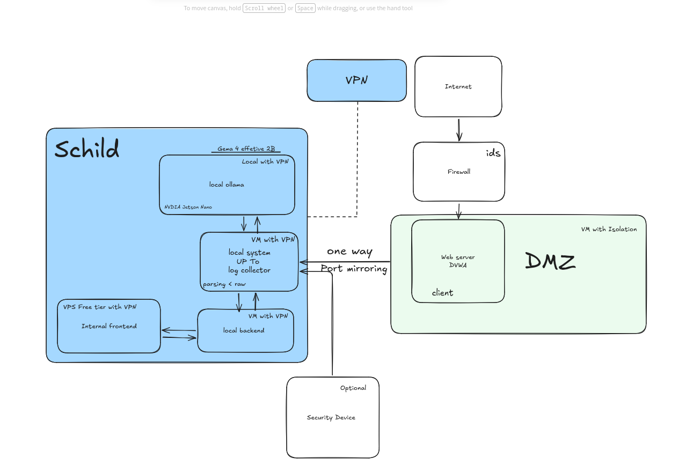

# SCHILD

Autonomous Engine for Guardian and Intelligent Security

SCHILD is an autonomous, out-of-band security platform designed to protect environments through real-time telemetry ingestion, passive network traffic analysis, and AI-orchestrated threat response. Centered around threat hunting hypotheses and zero-day detection, SCHILD integrates seamlessly into complex network architectures.

---

## System Architecture

SCHILD is deployed out-of-band to ensure zero latency impact on production systems. The engine listens passively to copied network traffic (via SPAN/Port Mirroring) and ingested log streams, keeping management interfaces isolated within secure networks.



---

## Core Capabilities

- **Passive Traffic Ingestion**: Monitors network traffic copies dynamically via SPAN/Port Mirroring using kernel-level Berkeley Packet Filters (BPF).
- **Multi-Source Log Collection**: Consolidates real-time streams from distributed assets using secure Syslog UDP endpoints and local file watchers.
- **Hypothesis-Driven Threat Hunting**: Systematically checks environment integrity using predefined detection heuristics aligned with the MITRE ATT&CK framework.
- **Behavioral Anomaly Detection**: Trains on local baselines using unsupervised statistical and Isolation Forest ML models to spot malicious behavior without signatures.
- **Autonomous Response Orchestration**: Adapts defensive actions dynamically (OBSERVE, HUNT, CONTAIN, ELIMINATE) based on configured security policies.
- **Self-Hosted AI Support**: Natively integrates with Ollama to run lightweight, high-performance models locally, ensuring complete data privacy.

---

## Prerequisites

- Operating System: Linux (Debian, Ubuntu, or CentOS recommended)
- Python Version: 3.10 or higher
- System Libraries: `libpcap-dev` (required for raw network interface packet capturing)
- Privileges: Root permissions or `CAP_NET_RAW` capabilities to bind raw sockets

---

## Installation

Begin by setting up the repository and preparing your local environment:

```bash
# Clone the repository
git clone git@jumpbox.tail22622a.ts.net:schild-dev/schild.git
cd schild

# Create and activate virtual environment
python3 -m venv venv
source venv/bin/activate

# Install package dependencies
pip install -e .
```

To enable port mirroring capture, install the packet analysis engine:

```bash
pip install scapy
```

---

## Configuration

Duplicate the configuration template to initialize your local environment settings:

```bash
cp schild/.env.example .env
```

### AI Backend Integration

Specify your selected LLM backend by modifying the environment file:

```env
# Selected Options: openai | anthropic | gemini | ollama
SCHILD_AI_PROVIDER=openai

# OpenAI Configuration
OPENAI_API_KEY=sk-...
SCHILD_TRIAGE_MODEL=gpt-4o-mini
SCHILD_ANALYST_MODEL=gpt-4o

# Anthropic Configuration
ANTHROPIC_API_KEY=sk-ant-...
SCHILD_ANTHROPIC_TRIAGE_MODEL=claude-haiku-4-5
SCHILD_ANTHROPIC_ANALYST_MODEL=claude-sonnet-4-5

# Google Gemini Configuration
GEMINI_API_KEY=AIza...
SCHILD_GEMINI_TRIAGE_MODEL=gemini-1.5-flash
SCHILD_GEMINI_ANALYST_MODEL=gemini-1.5-pro
```

### Ollama Configuration

For standalone or air-gapped systems, SCHILD integrates with Ollama.

#### Local Server Setup
```bash
# Install Ollama CLI
curl -fsSL https://ollama.com/install.sh | sh

# Pull desired detection model
ollama pull llama3

# Run service
ollama serve
```

#### Remote Server Setup
If Ollama resides on a separate high-performance VM, open its interface to accept network traffic:

```bash
sudo systemctl edit ollama.service
```

Add the host configuration within the service file:

```ini
[Service]
Environment="OLLAMA_HOST=0.0.0.0"
```

Reload and restart the daemon:
```bash
sudo systemctl daemon-reload
sudo systemctl restart ollama
```

#### Client Configuration
Point the SCHILD instance to your remote server:

```env
SCHILD_AI_PROVIDER=ollama
OLLAMA_BASE_URL=http://<your-ollama-server-ip>:11434
SCHILD_OLLAMA_TRIAGE_MODEL=llama3
SCHILD_OLLAMA_ANALYST_MODEL=llama3
```

---

## Telemetry Collectors

SCHILD consolidates three core passive telemetry sources concurrently.

### File Watcher
Tails local files and parses updates immediately upon disk-write. Natively decodes Apache Combined log formats and falls back to structured logs:

```python
agent.watch_log_file("/var/log/auth.log")
agent.watch_log_file("/var/log/nginx/access.log")
```

### Syslog Ingestion
Binds a UDP socket to receive system logs directly from remote systems without requiring local agents on those targets:

```python
# Listens on port 5140
agent.start_syslog_ingestion(host="0.0.0.0", port=5140)
```

Configure remote hosts (rsyslog) to pipe events to your SCHILD host:
```bash
echo "*.* @<your-schild-ip>:5140" | sudo tee /etc/rsyslog.d/50-schild.conf
sudo systemctl restart rsyslog
```

### Port Mirroring (SPAN)
Directly captures raw network frames passing through a mirrored switch port. The interface remains in promiscuous listen mode, meaning it generates zero network noise.

#### Detection Coverage
- **Layer 2 (ARP)**: Unsolicited responses, MAC/IP association changes, spoofing attempts.
- **Layer 3 (IP & ICMP)**: Route redirect manipulation (MITM), IP header inconsistencies.
- **Layer 4 (TCP & UDP)**: DNS queries/replies, suspicious port scanning, session anomalies.
- **Raw Payloads**: Command execution signatures (e.g. /bin/sh, curl, chmod), SQL injection patterns, XSS attempts.

#### Setup Privileges
Avoid running the main application as root by granting raw socket capabilities:

```bash
sudo setcap cap_net_raw+eip $(which python3)
```

#### Capture Filters (BPF)
Apply kernel-level BPF filters to process only high-value packets:

```python
# Capture all traffic on interface
agent.start_port_mirror(interface="eth1")

# Target web traffic exclusively
agent.start_port_mirror(interface="eth1", bpf_filter="tcp port 80 or tcp port 443")

# Ignore administrative traffic
agent.start_port_mirror(interface="eth1", bpf_filter="not port 22")
```

---

## Interactive Command Line

Initialize the interactive control console:

```bash
source venv/bin/activate
python3 -m schild
```

### Threat Defense Commands

| Command | Action |
|---|---|
| `schild hunt` | Evaluates all active MITRE ATT&CK hunt hypotheses |
| `schild hunt H-001` | Focuses on a single hypothesis |
| `schild zeroday` | Inspects current activity for zero-day parent-child process anomalies |
| `schild anomaly` | Performs behavioral comparison against generated baselines |
| `schild ml train` | Builds initial Isolation Forest models using local system baseline data |
| `schild ml update` | Incrementally adjusts ML models with recent telemetry data |
| `schild monitor start` | Commences continuous, automated security loops |
| `schild monitor stop` | Suspends active monitoring loops |
| `schild alerts` | Displays historical security alerts |
| `schild iocs` | Lists confirmed indicators of compromise (IOCs) |

### Capture Controls

| Command | Action |
|---|---|
| `schild mirror start <iface>` | Activates raw capture on specified interface |
| `schild mirror start <iface> <filter>` | Activates raw capture applying BPF filtering rules |
| `schild mirror stats` | Displays processing numbers, frame counts, and anomaly matches |
| `schild mirror stop` | Gracefully terminates active captures and ingestion layers |

---

## Developer API

You can orchestrate SCHILD directly within custom Python pipelines:

```python
from schild.core.agent import SchildAgent
from schild.core.config import DefenseMode, AIProvider

# Initialize agent in active hunting mode using local AI model
agent = SchildAgent(
    defense_mode=DefenseMode.HUNT,
    ai_provider=AIProvider.OLLAMA
)

# Start real-time syslog server
agent.start_syslog_ingestion(host="0.0.0.0", port=5140)

# Capture network copies
agent.start_port_mirror(interface="eth1", bpf_filter="not port 22")

# Run threat analysis manually
hunt_findings = agent.hunt()
zero_day_findings = agent.zero_day_scan()

# Query agent context programmatically
agent.single_prompt("Analyze the network log summary for SSH lateral movement indications.")
```

---

## Operational Architecture Scenarios

### 1. Minimal Deployment (Offline Local Model)
Designed for workstation protection or lightweight edge testing.

```
[Local Workstation]
    |-- SCHILD Engine
    |-- Local Log Watcher
    |-- Ollama (running locally on localhost:11434)
```

### 2. Segmented Deployment (Remote AI Node)
Distributes CPU load by offloading LLM querying to dedicated virtualization layers (e.g. VM or NVIDIA Jetson Nano).

```
[Target Server]                             [GPU VM]
   Log Watcher  --- (VPN Network) --->   Ollama Engine
   SCHILD Core                            (0.0.0.0:11434)
```

### 3. Enterprise DMZ (Full SPAN Implementation)
The full out-of-band deployment model, mirroring all live DMZ traffic to a central inspection engine.

```
Internet ---> Gateway ---> [Web / Application DMZ]
                                |
                   Switch SPAN Port (Passive Copy)
                                |
                       [SCHILD Inspection Node]
                                |
               +----------------+----------------+
               |                                 |
         [Storage DB]                  [Ollama Model Server]
```

---

## Pre-Packaged MITRE Hypotheses

| ID | Objective | Threat Tactic | Technique ID |
|---|---|---|---|
| H-001 | SSH Lateral Movement | Lateral Movement | T1021.004 |
| H-002 | Persistence via Scheduled Tasks | Persistence | T1053 |
| H-003 | Outbound Command and Control | Command and Control | T1071 |
| H-004 | Linux Credential Harvesting | Credential Access | T1003 |
| H-005 | Exfiltration over Alternative Protocol | Exfiltration | T1041 |
| H-006 | Log Evacuation and Clearing | Defense Evasion | T1070 |
| H-007 | System Privilege Elevation | Privilege Escalation | T1068 |
| H-008 | Zero-Day Process Spawning | Execution | T1059 |

---

## License

This software is released under the terms of the MIT License. Reference the LICENSE file for exact terms.
